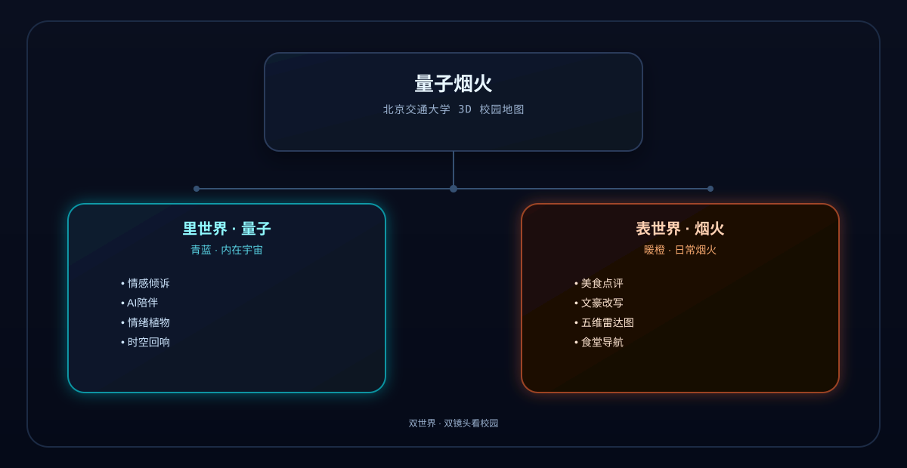

# 量子烟火 · 作品介绍文档

> 首届「火山杯」AI 应用创新大赛 · 参赛作品  
> 北京交通大学 · 2026 年 5–6 月  
> **在线体验**：https://bjtu.app  
> **文档版本**：v3.1 · 2026-06-09

---

## 作品提交材料对照

| 提交项 | 要求 | 本仓库对应文件 | 自检 |
|--------|------|----------------|------|
| **作品介绍文档** | 含简介、设计构思、技术思路、功能说明、应用价值分析；**≤5MB** | 本文档 `竞赛提交文档.md`（约 24KB）；可导出 PDF/Word 提交 | ✅ 体积远小于 5MB |
| **作品录屏** | **3–5 分钟**，清晰呈现智能体功能与应用效果；**≤50MB** | 制作指南 `docs/竞赛录屏脚本.md` | 待团队录制导出 |
| **演示 PPT** | 答辩演示用；**≤20MB** | 页纲 `docs/竞赛PPT大纲.md`（16–18 页） | 待按大纲制作 |

**本文档章节与组委会要求映射**：

| 组委会要求 | 本文档章节 |
|------------|------------|
| 简介 | **一、项目简介**（含二、选题背景与问题定义） |
| 设计构思 | **三、设计构思** |
| 技术思路 | **四、技术思路** + **七、Coze 平台使用说明** |
| 功能说明 | **五、功能说明** |
| 应用价值分析 | **六、应用价值分析** |

**配套材料**：Coze 复现细节见 `Coze配置手册.md`；答辩 PPT / 录屏分镜见 `docs/` 目录。

---

**参赛成员**

| 姓名 | 学院 | 身份 | 学号 |
|------|------|------|------|
| 李晨曦 | 经济与管理学院 | 研究生 | 25140257 |
| 钱韵 | 经济与管理学院 | 研究生 | 25140278 |
| 刘一鸣 | 计算机科学与技术学院 | 本科生 | 23281172 |

---

## 一、项目简介（含选题背景）

**量子烟火**（Quantum Fireworks）是一款面向北京交通大学在校生的**双模态校园情感智能体**，基于扣子编程（Coze）平台构建，深度融合高德 3D 地图技术与多智能体协作架构，覆盖「心理与情感支持」与「校园服务」两大核心场景。

项目以「**量子（内在自我）× 烟火（校园日常）**」为设计隐喻，创造性地将校园分为「**里世界**」与「**表世界**」两套交互体验：

- **里世界（量子）**：情感倾诉与 AI 陪伴——用户输入当下情绪，AI 给予诗意回应，同时将情绪以「植物」形态种植于交大 3D 地图的真实位置，形成个人情绪热力图，让压力与悲喜都有「落地之处」。
- **表世界（烟火）**：校园生活助手——基于大模型的食堂点评文豪化改写、多维美食战力雷达图，把日常「食堂吐槽」变成有温度的校园文化表达。

**当前状态**：已完成全功能原型并**部署上线**（https://bjtu.app），具备完整可演示、可传播、可答辩版本；Coze 三个 Bot + 两条核心工作流已联通，API Token 经 Vercel Serverless 代理，不暴露于前端。

---

## 二、选题背景与问题定义

### 2.1 北交大校园痛点

根据公开调研数据及日常观察：

- **心理健康压力大**：高校生心理健康问题发生率持续攀升，但多数同学遇到情绪困扰时「不知道该对谁说、说了怕被评判」，导致情绪长期积压。传统心理预约路径门槛高、周期长。
- **情绪表达缺少出口**：社交媒体匿名性强但传播失控，朋友圈过于公开，校园内缺乏安全的「情绪中间地带」。
- **校园日常内容匮乏**：食堂排队、菜品品质等高频话题缺乏有趣的信息化呈现，学生的日常感受难以形成有价值的校园内容积累。
- **空间与情感断连**：我们每天穿行于思源楼、图书馆、宿舍之间，却从不知道「这个地方承载过哪些情绪」——校园空间与学生情感之间存在感知断裂。

### 2.2 现有方案的不足

| 现有方案 | 局限性 |
|----------|--------|
| 心理咨询预约系统 | 使用门槛高，情绪即时性差 |
| 匿名树洞 App | 无空间感，情绪孤岛化 |
| 校园生活类小程序 | 功能单一，缺乏 AI 深度 |
| 通用情感 AI（ChatGPT 等） | 不了解北交大场景，回应缺乏共情 |

### 2.3 量子烟火的解法

**不做心理咨询替代品，做情绪着陆的安全空间。**

让学生以低门槛的方式（像写日记一样随手说）在校园地图上留下自己的情绪痕迹，同时获得 AI 的有温度回应——这是一种新型的「情感基础设施」：轻量、可视、有记忆、有共鸣。需要专业帮助时，可一键查看**心理素质教育中心**位置与电话，并阅读合规免责说明。

---

## 三、设计构思

### 3.1 核心设计理念：双世界 · 双镜头看校园

量子烟火的核心创新在于**用两套视角重新定义校园体验**：



**里世界**对应人的「内在宇宙」——情绪、焦虑、思绪，用赛博朋克蓝色调和量子物理隐喻呈现；  
**表世界**对应人的「日常烟火」——吃饭、排队、吐槽，用暖橙色调和幽默文化呈现。

两个世界通过同一张**北交大 3D 校园地图**联接，用户一键切换，地图底图与建筑配色随之联动（深黑/深蓝 ↔ 暖橙/冷蓝），配合 Web Audio 切换音效，实现沉浸式世界感知切换。

### 3.2 情绪植物：情感可视化的核心创新

当用户在里世界倾诉后，AI 不仅给出回应，还会根据情绪内容生成一株「**情绪植物**」，种植在用户当前所在校园地点（思源楼、图书馆、操场…），并在 3D 地图上以光柱 + 热力图的形式可见：

```
用户在思源楼输入："考前又焦虑了，代码还有好多没写完"
        │
        ▼
Inner Bot 情感回应（SSE 流式输出）
        +
情绪工作流 →  plant_type: "crystal"（焦虑→水晶草）
             plant_color: "#7b2fff"
             echo_text:  "此刻，一百公里外也有人在这个位置熬过同样的夜晚"
        +
3D 地图上思源楼位置升起一根紫色光柱
个人热力图密度 +1
```

**时空回响**：AI 从历史情绪语料中调取过去学长学姐的匿名留言，以诗意方式转述，并带有稀有度视觉框架——「你不是第一个在这里迷路的人」。

### 3.3 表世界：把吐槽变成文化

食堂吐槽是交大最高频的校园话题之一。表世界将这个高频但低价值的行为变成：

- **文豪化改写**：同一句吐槽，用 **12 种个性风格**重新表达（虎扑体、鲁迅体、冰心体、黛玉体、张爱玲体、王小波体、曼波体、二刺螈体、甄嬛体、苏轼体、鲁班手札、说明书体），既有娱乐性，也逼迫 AI 理解食堂评价的多维度情感
- **五维雷达图**：性价比、抗饿度、排队时间、口感、食材风险 → 量化呈现，形成食堂「战力图」
- **一键复制**：改写结果可复制到剪贴板，便于分享到群聊（分享图片卡片为后续迭代项）

### 3.4 空间化校园服务：地标、心理中心与实况天气

地图不仅是情绪容器，也是**校园服务的空间入口**：

- **历史地标故事卡**：毛主席像、詹天佑像、茅以升像——点击弹出校史与精神传承叙事
- **心理素质教育中心**：标定于主校区**第二教学楼**（坐标实测），提供机构说明、预约指引、学生/教职工专线一键拨号
- **海淀实况天气**：启动后同步海淀区天气，驱动 HUD 与轻量氛围效果（阴/多云优先保证地图可读性），让「今日校园」有真实时空感

---

## 四、技术思路

### 4.1 整体架构

```
用户端（浏览器 · React 18 + Vite）
        ├── 高德地图 JS API 2.0（3D · Buildings · 热力图 · 光柱 · Weather 插件）
        ├── UI 层（Tailwind CSS · Framer Motion · ECharts 雷达图 · Lucide）
        └── Zustand（worldStore + emotionStore + weatherStore）
                │  HTTPS  /api/*
                ▼
        Vercel Serverless（api/）
                ├── /api/router      → Router Bot
                ├── /api/inner/stream → Inner Bot（SSE 流式）
                ├── /api/outer       → Outer Bot
                ├── /api/emotion     → 情绪工作流
                ├── /api/food        → 美食工作流
                ├── /api/weather     → 高德天气 REST 代理（可选）
                └── /api/health      → 健康检查
                │  Token 仅存服务端
                ▼
        扣子编程（Coze）平台
                ├── Router Agent     意图分类路由
                ├── Inner Bot        里世界情感智能体
                ├── Outer Bot        表世界美食智能体
                ├── 情绪工作流       植物生成 + 回响检索
                └── 美食工作流       文体改写 + 雷达数据
```

**本地开发**：Vite 将 `/api` 代理至 `量子烟火-server`（Express），与 Vercel 函数共用 `api/_lib/coze-proxy.js` 逻辑。

**降级策略**：Coze 或网络异常时，前端自动降级至本地 Mock 流式/Mock 工作流数据，保证演示与答辩不中断。

### 4.2 Coze 平台核心配置

#### 4.2.1 三层 Agent 架构

**① 主控路由 Agent（Router Bot）**

- 职责：接收用户输入 + 当前校园位置，自动判断意图，分发到里/表世界
- 系统提示词核心逻辑：
  ```
  你是量子烟火的智慧入口。请判断用户意图：
  - 涉及焦虑/迷茫/难过/考试压力/内耗 → {"world": "inner", "intent": "emotion_anchor"}
  - 涉及食堂/菜品/排队/吃饭/吐槽 → {"world": "outer", "intent": "food_review"}
  输出纯 JSON，不附说明。
  ```
- 调用方式：非流式，经 `/api/router` 代理，解析 JSON 后前端路由

**② 里世界 Agent（Inner Bot）**

- 职责：情感陪伴、诗意回应
- 知识库挂载：王阳明心学精选、交大历届学生匿名情感语料、存在主义哲学选段
- 数据库：`mood_tracks` 表（记录用户情绪时序，支持纵向分析）
- 系统提示词方向：拒绝说教，以隐喻和共情回应，每次植入一句适配的引用
- 调用方式：**SSE 流式输出**，经 `/api/inner/stream` 代理，打字机效果实时呈现

**③ 表世界 Agent（Outer Bot）**

- 职责：美食点评改写、雷达图数据分析
- 数据库：`food_ratings` 表（食堂评分数据积累）
- 系统提示词方向：**12 种角色扮演式人设深度切换**，参考 Chat-嬛嬛（DataWhale）的角色 LoRA 微调思路，改用 Prompt Engineering 在 Coze 平台零成本实现等效角色扮演能力
- 调用方式：非流式，通过美食工作流或 Outer Bot 返回结构化 JSON

> 详细 Bot ID、工作流节点与 Prompt 见 [`Coze配置手册.md`](./Coze配置手册.md)。

#### 4.2.2 两条核心工作流

**情绪工作流（emotion_workflow）**

```
输入：userText, location{lng,lat,name}
  │
  ├── LLM 节点：分析情绪类型（焦虑/失落/欣喜/迷茫/愤怒）
  │
  ├── 选择节点：情绪 → 植物映射
  │         焦虑→水晶草, 失落→枯萎花, 欣喜→星光草, 迷茫→迷雾藤
  │
  ├── 知识库检索：匹配历史时空回响语料
  │
  └── 输出：{plant_type, plant_color, plant_glow, echo_text}
```

**美食工作流（food_workflow）**

```
输入：dishName, originalReview, targetStyle
  │
  ├── LLM 节点：按 targetStyle 内置角色人设改写评论
  │         支持 12 种文体（见 3.3 节）
  │
  ├── LLM 节点：生成五维评分
  │         {price, fullness, queue, taste, risk} 各 0–10
  │
  └── 输出：{rewritten_text, radar_data, style_id}
```

### 4.3 前端关键技术

| 模块 | 技术实现 |
|------|----------|
| 3D 校园地图 | 高德 JS API 2.0，`viewMode:'3D'`，pitch 随世界/天气微调，建筑色彩随世界切换（Buildings 图层缓存） |
| 地标定位 | 10+ 校园 POI **坐标拾取实测**硬编码，含三食堂、思源楼、图书馆、心理中心等 |
| 情绪植物热力图 | `AMap.HeatMap` + 光柱 CSS animation + `EmotionParticles` 上升粒子 |
| 世界切换 | Zustand 全局状态 + Framer Motion + Web Audio API 切换音效 |
| 流式输出 | Fetch SSE + `ReadableStream`，打字机渲染 |
| 五维雷达图 | ECharts 5 radar，动态数据注入 |
| 情绪历史 | `localStorage` 持久化，折叠时间轴（最近 10 条）+ JSON 导出 |
| 实况天气 | 优先 `AMap.Weather` 插件，失败回退 `/api/weather`；同日缓存 `qf_weather_v1` |
| 启动体验 | 骨架屏 + 打字机阶段文案 + 北交大/火山杯品牌露出 |
| 社交分享 | Open Graph / Twitter Card + `og-image.png`（1200×630） |
| 性能监控 | Vercel Speed Insights |
| 状态管理 | Zustand（`worldStore` / `emotionStore` / `weatherStore`） |

### 4.4 数据流向图

```
用户输入
   │
   ├─[里世界]→ Inner Bot（SSE 流式）→ 实时打字机回应
   │               │
   │           情绪工作流 → {植物类型, 颜色, 时空回响}
   │               │
   │           3D 地图：对应坐标升起光柱 + 热力图 +1
   │               │
   │           localStorage：本地持久化情绪历史 + 可导出 JSON
   │
   └─[表世界]→ 美食工作流（非流式）→ {改写文本, 雷达数据, style_id}
                   │
               五维雷达图渲染 + 一键复制到剪贴板
```

---

## 五、功能说明

### 5.1 功能总览

| 功能模块 | 子功能 | 状态 |
|----------|--------|------|
| **里世界 · 情感 AI** | 流式情感对话（Inner Bot） | ✅ |
| | 地点选择（思源楼/图书馆/实验室/操场/宿舍/红果园） | ✅ |
| | 情绪植物种植 + 校园地图光柱 | ✅ |
| | 个人情绪热力图 | ✅ |
| | 时空回响卡片（稀有度框架） | ✅ |
| | 情绪历史时间轴（折叠 + 最近 10 条） | ✅ |
| | 情绪数据 JSON 导出 | ✅ |
| | 心理合规免责 + 求助入口 | ✅ |
| **表世界 · 美食 AI** | 三食堂选择 + 3D 地图飞跃定位 | ✅ |
| | 美食评论文豪化改写（**12 种风格**） | ✅ |
| | 五维战力雷达图 | ✅ |
| | 改写结果一键复制 | ✅ |
| | 美食/雷达趣味数据免责 | ✅ |
| **全局 · 地图** | 北交大 3D 建筑地图（高德 API） | ✅ |
| | 里/表世界底图 + 建筑配色实时切换 | ✅ |
| | 地标标记 + 点击定位飞跃 | ✅ |
| | 校园历史地标故事卡（毛主席像/詹天佑像/茅以升像） | ✅ |
| | 心理素质教育中心信息卡（第二教学楼） | ✅ |
| | 世界切换动画 + 音效 | ✅ |
| | BJTU 点阵灯光装饰 | ✅ |
| **全局 · 体验** | 启动屏（骨架屏 + 打字机 + 火山杯露出） | ✅ |
| | 海淀实况天气 HUD + 轻量氛围 | ✅ |
| | 移动端底部抽屉 / safe-area / 卡片层级优化 | ✅ |
| | Open Graph 分享元数据 | ✅ |
| | Vercel 生产部署 + API 代理 | ✅ |

> 以上均为**截止提交日已上线**功能。后续迭代项见 **附录 A**。

### 5.2 核心交互流程

**里世界核心流程：**

```
进入里世界 → 选择当前所在地点 → 输入今天的心情/困惑
    → AI 流式情感回应（~3–5 秒）
    → 情绪植物出现在地图对应位置（光柱 + 热力图）
    → 时空回响卡片弹出（来自过去学长学姐的匿名留言）
    → 情绪历史自动记录，可折叠查看时间轴 / 导出 JSON
    → 需要专业帮助时：地图打开心理中心 → 一键拨号
```

**表世界核心流程：**

```
进入表世界 → 选择食堂（地图同步飞跃定位）→ 输入菜品 + 吐槽
    → 选择风格（12 种文豪/梗体）→ AI 生成改写版本
    → 五维雷达图动态渲染
    → 一键复制，分享给朋友
```

### 5.3 校园地标与心理服务

**历史地标故事卡**

在地图层展示北交具有代表性的文化地标（毛主席像、詹天佑像、茅以升像），用户点击标记弹出故事卡：

- 基础信息：人物简介、在北交的历史渊源、精神传承标签
- 交互体验：卡片关闭后地图恢复；内容与校史公开资料对齐
- 价值：让地图不止是导航工具，也是校园文化的「可点击记忆」

**心理素质教育中心**

- 位置：主校区**第二教学楼**（坐标实测标定）
- 卡片内容：机构说明、服务对象、预约指引、地址
- 电话：学生心理中心 `010-51685166`、教职工关爱工作室 `010-51685882`（支持 `tel:` 一键拨打）
- 合规：明确「非心理咨询替代品」，与里世界 `PsychDisclaimer` 联动

---

## 六、应用价值分析

### 6.1 社会价值

**心理健康层面（核心价值）**

传统心理援助系统存在「使用门槛高、即时性差、污名化顾虑」三大障碍。量子烟火提供了一种**「情绪着陆」的轻量化路径**：

- 不是替代咨询，而是提供「先说出来」的安全空间
- 情绪植物的可视化让抽象的「我很难受」变成具体的「这个地方承载过我的难受」
- 时空回响让学生感知到「不孤独」——校园空间本身有历史、有温度
- 心理中心地图标注与电话入口，形成「轻陪伴 → 专业求助」的梯度路径

**校园文化层面**

随时间积累，量子烟火将形成北交大独特的**情绪地理图谱**（个人层已实现，聚合层为后续方向）：

- 哪个地点情绪密度最高？（图书馆考前焦虑带）
- 哪个时间段负面情绪爆发？（期末周）
- 校园情感重心如何随季节迁移？

这些数据可为学校心理健康工作提供参考，也是对北交大百年历史的一种新型数字记录。

### 6.2 创新性

| 维度 | 量子烟火的差异化 |
|------|-----------------|
| 情感表达方式 | 文字 → 植物 → 地图坐标，三层转化，情绪有了「物理形态」 |
| 时间连接 | 时空回响机制，打通不同届学生的情感链接 |
| 空间感知 | 情绪落地于真实校园坐标，而非虚空的树洞 |
| 双模态设计 | 里/表世界切换，同一应用覆盖「心理健康」和「校园生活」两大场景 |
| 文化娱乐化 | 食堂吐槽 12 文体改写，把低价值抱怨变成有趣内容 |
| 角色扮演式 Prompt Engineering | 参考 Chat-嬛嬛思路，在 Coze 用系统提示词实现深度角色扮演——无需 GPU 训练 |
| 合规先行 | 心理/美食/雷达三类免责 + 心理中心空间化入口 |
| 工程化部署 | Vercel Serverless 代理 Coze，Token 安全 + Mock 降级，适合竞赛答辩与校内试点 |

### 6.3 可行性

- **技术可行**：原型已全部实现并上线，Coze 三个 Bot + 两个 Workflow 均已搭建并联通
- **成本可控**：前端静态托管（Vercel），Coze 免费额度 + 高德教育配额，学生团队年化运维约 ¥5k–20k
- **运营路径**：初期面向北交大，可复制至其他高校（换地图 POI + Bot 知识库 + 合规联系人，核心代码约 70% 可复用）
- **合规安全**：情绪数据默认本地存储（`localStorage`），无账号库；AI 回应有兜底提示，非专业心理干预

### 6.4 扩展方向

| 方向 | 说明 | 阶段 |
|------|------|------|
| 多用户共享热力图 | 匿名聚合 plants，形成 campus 级共情地图 | 阶段 3 |
| 危机关键词 gentle 引导 | 前端 + Coze 审核，flyTo 心理中心 | 冲刺 S-07 |
| 表世界分享图片 | 改写 + 雷达生成传播卡片 | 冲刺 S-03 |
| 演示模式 | `?demo=1` 预置数据，答辩零风险 | 冲刺 S-01 |
| 学校统一认证（CAS） | 跨设备同步、校内身份校验 | 阶段 2 |
| 教师端聚合面板 | 匿名网格化情绪统计，辅助学工决策 | 阶段 4 |
| 一校多区 | 红果园、沙河校区独立地图模块 | 中长期 |

> 完整路线图与商业化分析见 [`后续计划与商业化.md`](./后续计划与商业化.md)。

---

## 七、Coze 平台使用说明

本项目 **100% 基于扣子编程（Coze）平台** 完成智能体核心功能开发：

| Coze 功能 | 使用方式 |
|-----------|----------|
| Bot（智能体） | 3 个：Router Bot / Inner Bot / Outer Bot |
| 知识库（RAG） | Inner Bot 挂载：心理支持语料 + 时空回响语料库 |
| 数据库 | `mood_tracks`（情绪记录）+ `food_ratings`（食堂评分） |
| 工作流 | 情绪工作流（植物 + 回响）+ 美食工作流（文体改写 + 雷达） |
| API 调用 | 经 Vercel `/api/*` 代理；流式 SSE + 非流式 JSON + Workflow run |
| 降级与 Mock | 网络/Token 异常时前端 Mock，保障演示连续性 |
| 多模态能力 | 未来计划接入语音输入（降低倾诉门槛） |

**与火山引擎的关系**：启动屏标注「Powered by 扣子编程 × 火山引擎」；生产环境部署于 Vercel，Coze 为 AI 能力唯一后端。

---

## 八、部署与演示说明

| 项目 | 信息 |
|------|------|
| 生产地址 | https://bjtu.app |
| 部署平台 | Vercel（Root Directory: `量子烟火`） |
| 环境变量 | Coze Token / Workflow URL、高德 Web Key 等（见 `VERCEL.md`） |
| 健康检查 | `GET /api/health` |
| 推荐演示路径 | 启动屏 → 里世界倾诉 → 植物落地 → 切换表世界 → 文豪改写 + 雷达 → 地图心理中心 |
| 录屏脚本 | [`docs/竞赛录屏脚本.md`](./docs/竞赛录屏脚本.md)（目标 4:00，导出 ≤50MB） |
| 演示 PPT | [`docs/竞赛PPT大纲.md`](./docs/竞赛PPT大纲.md)（16–18 页，≤20MB） |

**答辩节奏参考（5 分钟）**：

| 时段 | 内容 |
|------|------|
| 0:00–0:30 | 痛点：情绪没地方落、吐槽没温度、空间与情感断连 |
| 0:30–1:30 | 双世界切换 → 地图变色 → 建筑配色联动 |
| 1:30–3:00 | 里世界：倾诉 → 流式回应 → 植物 → 时空回响 |
| 3:00–4:00 | 表世界：吐槽 → 12 文体改写 → 雷达 → 复制分享 |
| 4:00–4:30 | 技术：Coze 多 Agent + 工作流 + Vercel 代理 + 心理中心合规 |
| 4:30–5:00 | 愿景：校内情感基础设施，非心理咨询替代品 |

---

## 九、团队与作品信息

| 项目 | 信息 |
|------|------|
| 作品名称 | 量子烟火（Quantum Fireworks） |
| 参赛方向 | 09 心理与情感支持 / 08 健康关怀 / 05 校园服务 |
| 技术栈 | 扣子编程（Coze）+ React + Vite + Zustand + 高德地图 JS API 2.0 + Vercel |
| 开发状态 | **已上线可演示**（https://bjtu.app） |
| 开源仓库 | GitHub · Leo-610/quantum-firework |

---

## 十、相关文档索引

| 文档 | 路径 | 用途 |
|------|------|------|
| **PPT 大纲** | `docs/竞赛PPT大纲.md` | 16–18 页答辩结构（≤20MB） |
| **录屏脚本** | `docs/竞赛录屏脚本.md` | 3–5 分钟分镜与导出参数（≤50MB） |
| 后续计划与商业化 | `后续计划与商业化.md` | 路线图、冲刺 backlog、商业化 |
| 功能完善计划（早期） | `plan.md` | 工程债务进度（已合并入主计划） |
| Coze 配置手册 | `Coze配置手册.md` | Bot / 工作流复现（评审用） |
| Vercel 部署 | `VERCEL.md` | 生产环境配置 |
| Agent 开发指南 | `AGENTS.md` | 仓库结构与本地启动 |

---

## 附录 A · 后续迭代（非提交日必需）

| 功能 | 说明 |
|------|------|
| 演示模式 `?demo=1` | 预置数据，答辩零风险 |
| Router 意图可视化 | 展示 Coze 路由链路 |
| 表世界分享图片 | 改写 + 雷达生成传播卡片 |
| 危机关键词引导 | flyTo 心理中心 |
| 多用户聚合热力图 | 需后端与合规评审 |

---

> *「你在红果园种下的不只是情绪，是这一刻的你，被时间记住。」*  
> ——量子烟火

---

**文档版本**：v3.1 · 2026-06-09  
**变更摘要（v3.1）**：新增作品提交材料对照表；功能说明仅保留已上线项；附录分离后续迭代；链入 PPT 大纲与录屏脚本。
